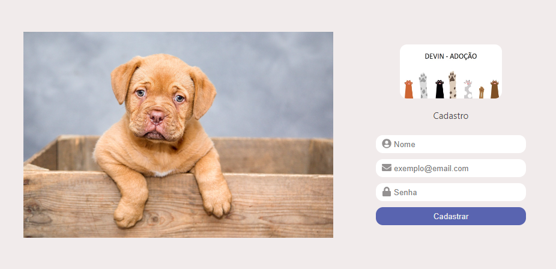
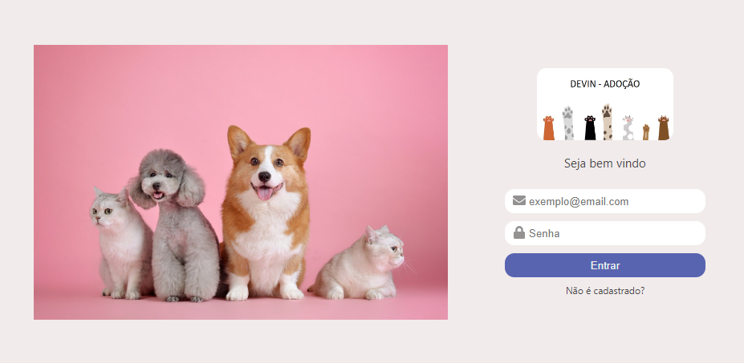

# DEVin-Adotion

Este projeto é um sistema de controle de estoque para ONGs. Com ele é possível identificar a quantidade de estoque de produtos para tratamento e alimentação de cães e gatos, de acordo com sua categoria de adulto ou filhote.

## Funcionalidades do projeto

✔️ Cadastro de Usuário
* Nome
* E-mail
* Senha

✔️ Login de Usuário
* E-mail
* Senha

✔️ Estoque
* Nome do Estoque
* Situação
* Tipo de Produtos
    * gato
    * cachorro

✔️ Produtos
* Estoque do Produto
* Quantidade
* Tipo de Produto
    * gato
    * cachorro
* Categoria de animal
    * Filhote
    * Adulto

## Layout
### Tela de Cadastro


### Tela de Login



## Como rodar este projeto ?
```bash
# Clone este repositório
$ Git clone link-do-repositório

# Acesse a pasta do projeto no seu terminal
$ cd adotation

# Instale as dependências
$ npm install

# Execute a aplicação
$ npm start

# A aplicação será iniciada na porta 3000, acesse pelo navegador http://localhost:3000
```

## Tecnologias utilizadas
✔️ React

✔️ React Router

✔️ React Icons

✔️ CSS

✔️ HTML


#

## 👏Pessoas envolvidas no projeto

<a href= "https://www.linkedin.com/in/maristelapeglow/" target= "_blank"> Maristela
#
<a href= "https://www.linkedin.com/in/renato-aires-5128b7189/" target= "_blank"> Renato
#
<a href= "https://www.linkedin.com/in/vini-andrade-35ab6421/" target= "_blank"> Vinícius


## Considerações sobre o projeto:

Algumas funcionalidades não foram completamente implementadas.
A exigência de não poder apagar um estoque, quando há produtos nele, está sendo atendida, mas não conseguimos a tempo enviar esta informação ao front-end.

Algumas operações têm se mostrado pesadas, e não sabemos se é por causa de nossos equipamentos, ou se há formas de deixar as funções mais leves.

Não conseguimos, a tempo, retirar a NavBar da página de Login (o que seria recomendável, embora o exercício não tenha exigido).

Outras funções, como a exibição da situação do estoque, não conseguimos terminar de implementar. Tentamos muitas lógicas, mas não chegamos a uma conclusão final. Estamos enviando com o código interminado, para que vocês possam nos instruir, na hora da correção, caso seja possível.

Agradecemos por este curso e por todo o aprendizado compartilhado pelos professores!